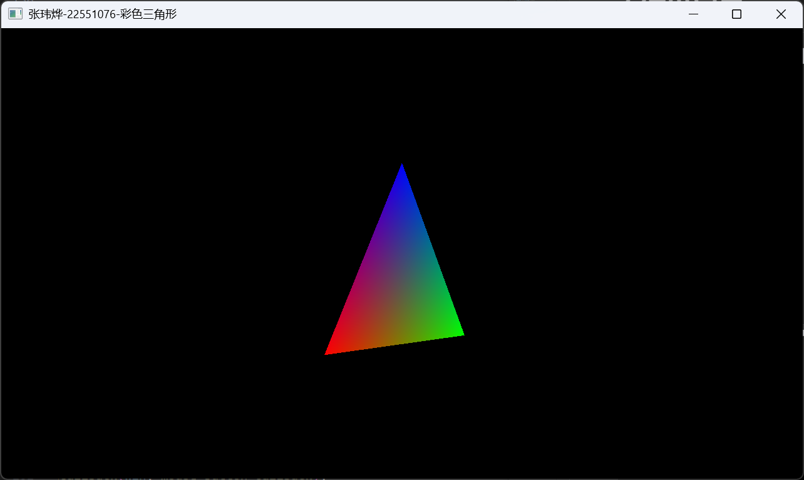
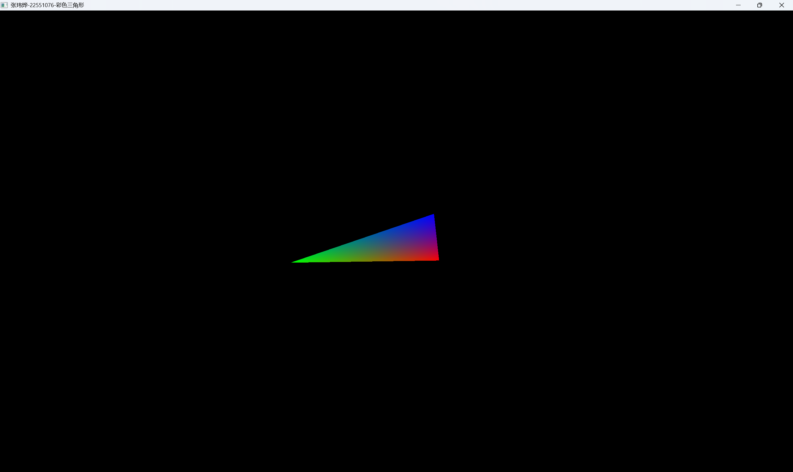

张玮烨-22551076

# 1.环境要求
|环境|版本|
|-|-|
|操作系统|Windows 11|
|OpenGL版本|3.3|
|Cmake版本|4.2.0|
|mingw32版本|gcc 6.3.0,make3.82.90|
|IDE|Visual Studio code|

注：OpenGL相关文件(glad与glfw)已经在Work1文件夹下，无需额外下载。  
只需要安装cmake和mingw32即可编译运行。

# 2.编译步骤
1.进入Work1文件夹  
2.文件夹下执行``make``或``make run``命令  
3.执行以后会在Work1文件夹下的output文件夹下生成可执行文件``main.exe``（如果为``make run``，会自动开启窗口）  
4.双击运行``main.exe``即可看到结果 
# 3.操作说明
1.如果不做任何操作，会看到彩色三角形在画面中匀速旋转  
2.鼠标左键在画面中拖动，三角形会跟随旋转  
3.松开鼠标左键，三角形将会接续当前角度继续匀速旋转  
4.放大或缩小窗口三角形会随之放大或缩小  
# 4.结果展示

