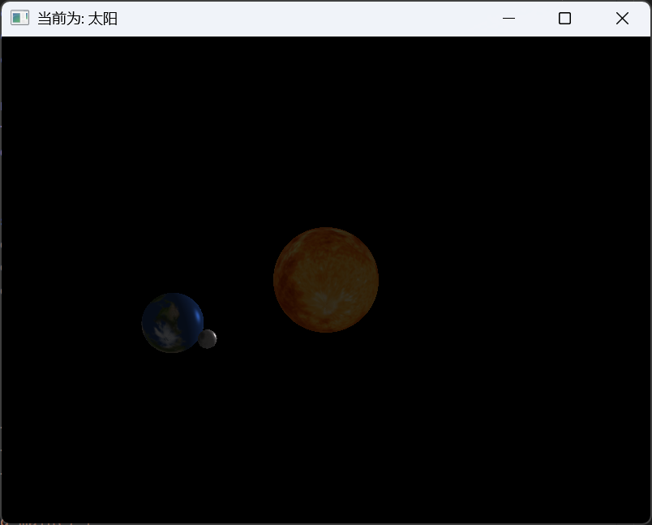
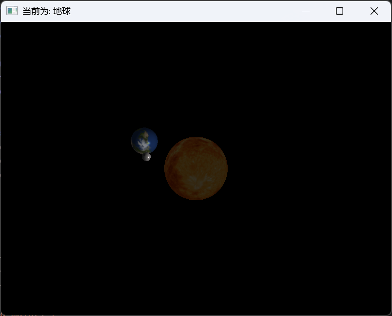
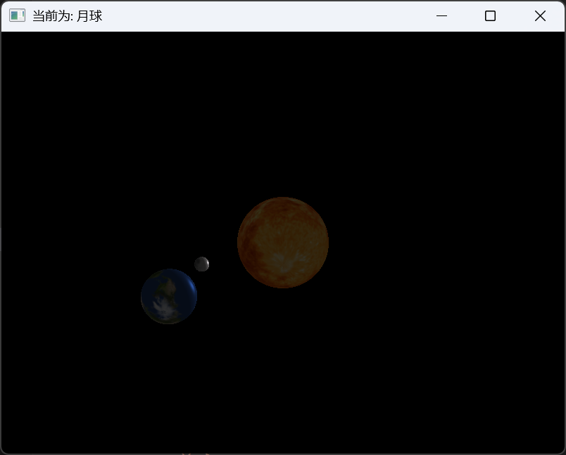

张玮烨-22551076

# 1.环境要求
|环境|版本|
|-|-|
|操作系统|Windows 11|
|OpenGL版本|3.3|
|Cmake版本|4.2.0|
|mingw32版本|gcc 6.3.0,make3.82.90|
|IDE|Visual Studio code|
|glm|1.0.2|
|stb_image.h|-|

**1.opengl环境搭建：**
1.1 前往https://www.glfw.org/download.html 下载glfw库，选择“Windows 下载 32 位二进制版本”，解压；  
1.2 前往https://glad.dav1d.de/ 下载glad，gl 选 3.3 版本，profile 选 core，点击 generate 生成，下载 zip并解压  
1.3 在解压以后的glad目录执行如下命令：
```
gcc ./src/glad.C -c -I ./include/
ar -rc libglad.a glad.o
```
1.4 在项目根目录下新建lib文件夹，并在其中粘贴如下文件：来自于 glfw文件夹下，lib-mingw-w64中的libglfw3dll.a和libglfw3.a；以及glad文件夹下的libglad.a文件。

1.5 在项目根目录新建output文件夹，将glfw文件夹下，lib-mingw-w64中的glfw3.dll文件粘贴到output文件夹下。

1.6 在include中 放入stb_image.h文件，和glm下载解压获得的glm文件夹。

2.安装cmake和mingw32，此后即可编译运行。

# 2.编译步骤
1.进入Work2文件夹  
2.文件夹下执行``make``或``make run``命令  
3.执行以后会在Work2文件夹下的output文件夹下生成可执行文件``main.exe``（如果为``make run``，会自动开启窗口）  
4.双击运行``main.exe``即可看到结果 
# 3.操作说明
1.如果不做任何操作，会看到太阳，月亮，地球在窗口中运行.其中以太阳为光源照亮地球和月球 
2.将鼠标移动到任意一个星球上，窗口标题将会以当前为：{星球名}的形式展示。
# 4.结果展示






