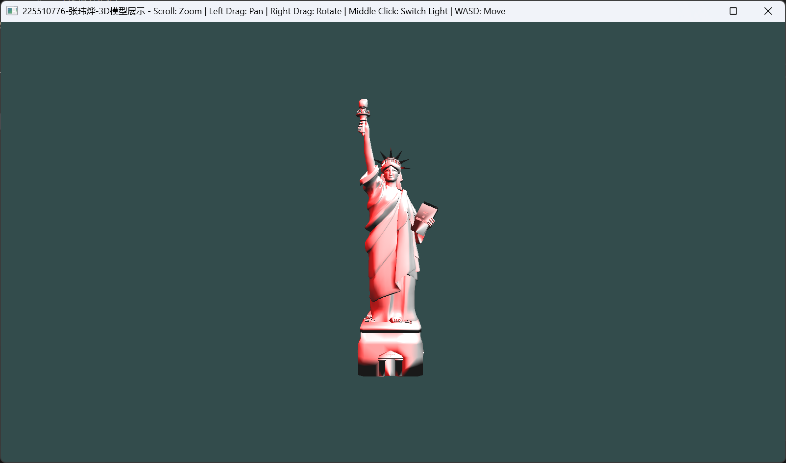
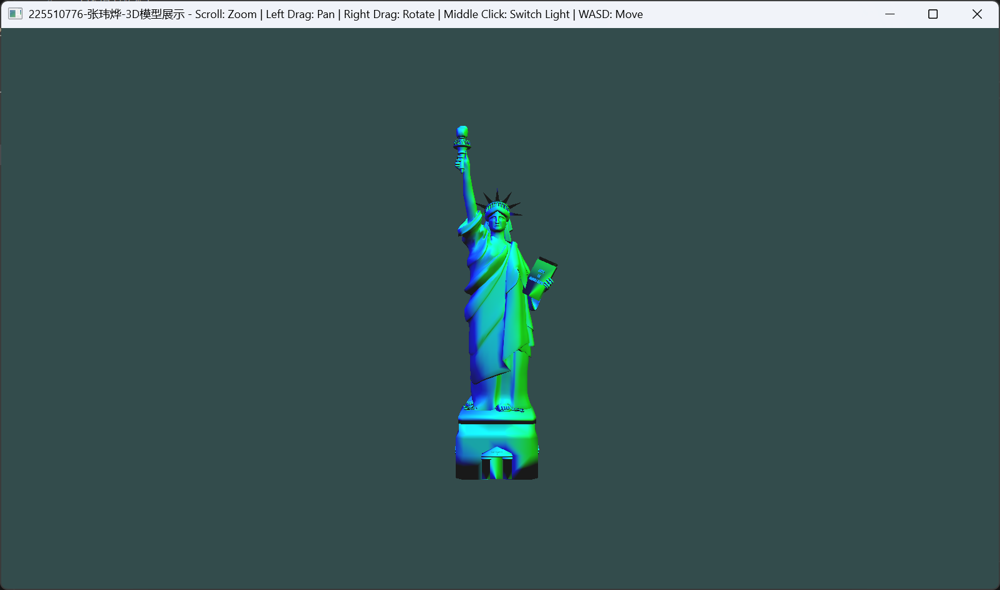
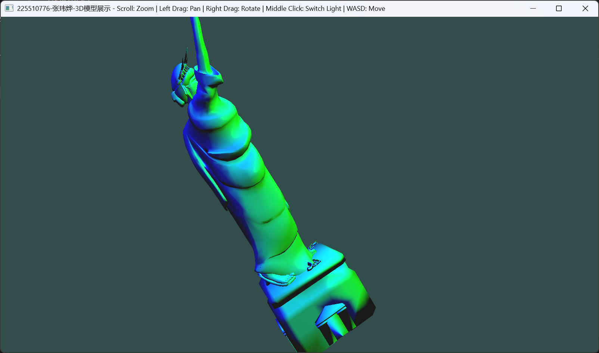

张玮烨-22551076

# 1.环境要求
|环境|版本|
|-|-|
|操作系统|Windows 11|
|PyOpenGL版本|3.1.10|
|python版本|3.11|

**1.环境搭建：**  
执行：
```
pip install numpy glfw PyOpenGL PyOpenGL_accelerate pillow trimesh pyrr freetype-py matplotlib 

```
说明：使用trimesh读取模型文件 
# 2.操作说明
支持OBJ格式模型，本程序将展示自由女神像，支持多光源照明及颜色切换，场景移动和模型操作。  
1.执行`python main.py`即可运行程序。  
2.支持如下操作：鼠标左键按住平移 鼠标右键按住旋转 鼠标滚轮缩放 键盘WASD移动相机位置 鼠标中键切换光源颜色。  
3.光源颜色包括：红白，蓝绿，粉黄三种模式，光源分别在左上角与右上角。
# 3.结果展示





