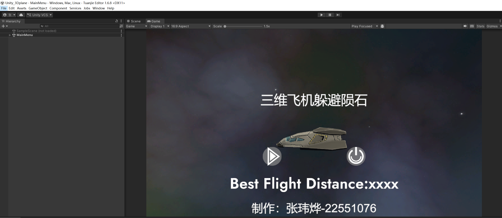
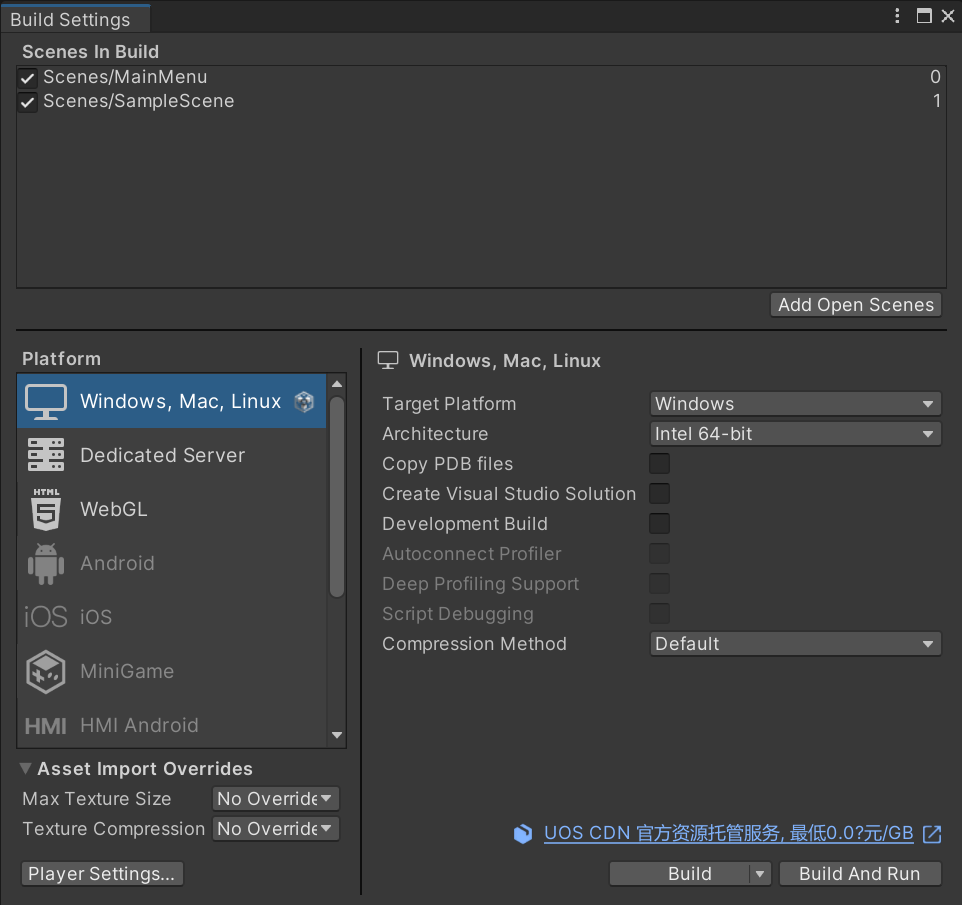
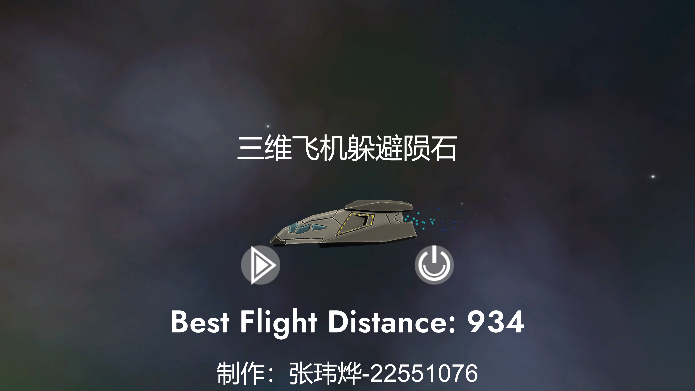
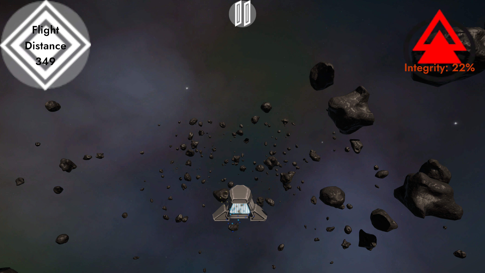
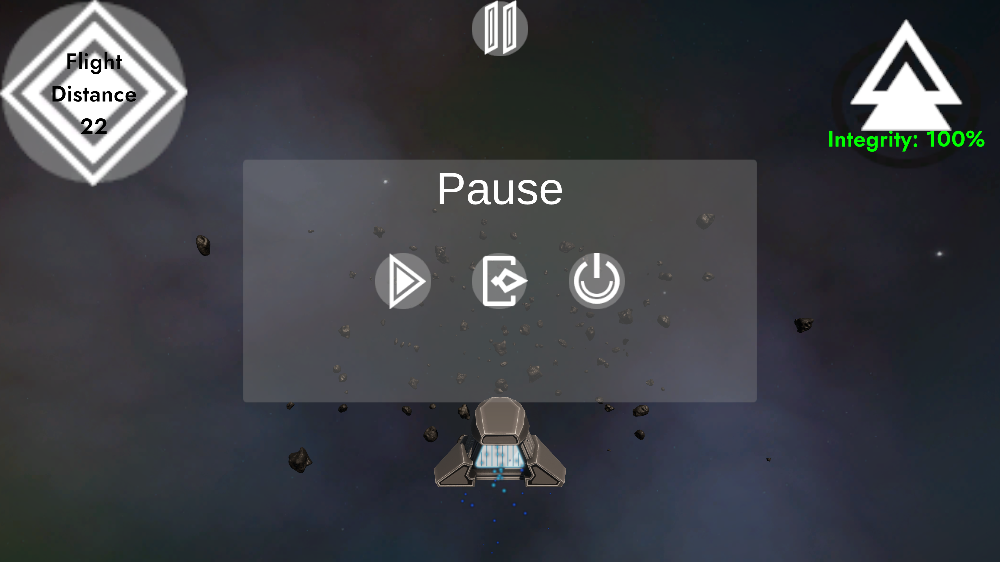
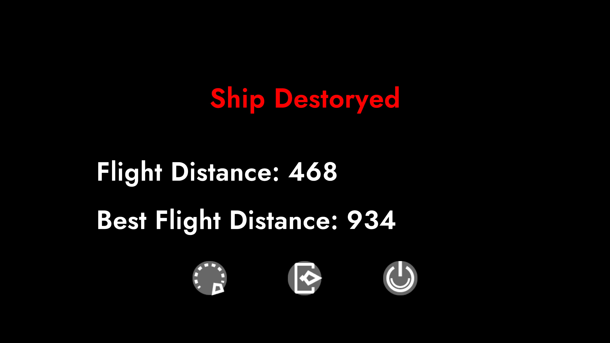

姓名：张玮烨
学号：22551076

# 作业名称：三维飞机躲避陨石
# 环境配置：
|软件|版本|
|-|-|
|Unity Editor|tuanjie 1.6.8|
|Rider|最新版即可|
# 构建说明
1.通过unityhub导入Unity_3Dplane文件夹，作为unity项目  
2.首先进入scenes文件夹，将两个场景都拖入Hierarchy，并删除Unity生成的untitled场景  
3.点击左上角的File->Build Settings(如下图所示)  

4.在弹出的窗口（如下图所示）中点击Add Open Scenes，确保所有场景均打勾且MainMenu为0号场景  

5.点击弹出窗口右下角的Build And Run，等待构建完毕 游戏将自动打开  

# 操作说明
本游戏目标为操控飞船，躲避密集的陨石，以飞行距离作为评判标准，距离越长越好。飞行速度会随着游戏进行逐步加快。
## 页面1 主菜单

该界面有两个按钮：左侧按钮为开始游戏，右侧为退出游戏。
下一行的Best Flight Distance将会展示最佳飞行距离，如果未游玩过将显示No Play Record

## 页面2 游戏页面

该页面下 通过按键盘的wasd控制飞船上下左右躲避陨石；左上角展示当前飞行距离 右上角展示当前飞船状态（即血量），撞击不同陨石将会有不同的血量减扣，这与陨石mass有关。在该状态下，可以通过按下最上方中间的暂停按钮或Esc暂停游戏。之后会弹出暂停界面：

在该界面下，点击Esc可以恢复游戏；点击左一按钮可以恢复游戏；点击中间按钮可以返回主菜单；点击右一按钮可以退出游戏。  
当飞船血量耗尽时，将会游戏失败，并展示游戏结束的界面：

左一按钮表示重新开始，点击中间按钮可以返回主菜单；点击右一按钮可以退出游戏。

# 其他说明
1.通过unity引擎完成demo制作，可以完整游玩基本功能  
2.通过URP渲染管线实现飞机，陨石等三维模型的渲染  
3.通过添加粒子效果实现了陨石碰撞，飞船尾焰及飞船爆炸效果  
4.利用PlayerPrefs实现存档功能，可以记录个人最远飞行记录  
5.通过控制摄像头，实现了玩家跟踪，碰撞摇晃等视觉效果
6.通过添加碰撞体实现了陨石碰撞，并会产生陨石被飞船撞飞的效果

# 游戏展示视频见Game_show.mp4
