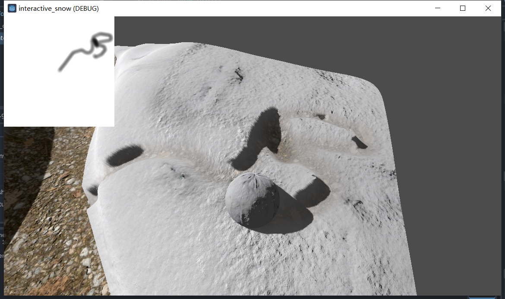

# 期末大作业：交互式雪地

---

## 简介
实现了可交互的雪地效果。可通过滚动雪球在雪地留下痕迹。



## 开发环境
本项目基于以下工具进行开发：
* Blender v5.0.1
* Godot v4.1.3

**[注]：由于本项目导出包压缩后仍然超过100MB，可执行文件被放在fork仓库的Release中**。

## 运行与基本操作
解压`/app/app.zip`双击`interactive_snow.exe`运行即可
* `W` - 向前
* `A` - 向左
* `S` - 向后
* `D` - 向右
* `鼠标移动` - 改变相机视角
* `鼠标滚轮` - 视角缩放
* `Esc` - 呼出/隐藏鼠标

---

## 基本原理与实现
### 初始化
首先需要渲染雪地和土路的初始状态。本项目通过Blender建模了一个简单曲面，在`Vertex Paint`模式下，为曲面顶点上色，雪地部分为红色，土路部分为黑色。模型导入资源见`/source/models`

随后将模型导入Godot，为`Grid`节点附加`ShaderMaterial`，并为该材质编写着色器。主要原理是：
* 对**顶点着色器**，基于参数`snow_height`，将红色通道为`1.0`的顶点抬高，以模拟积雪效果。
* 对**片段着色器**，将红色通道为`1.0`的片段渲染为雪地；`0.0`的部分渲染为泥土

### 基本交互
为场景添加了基本的交互功能，包括：
* **可操作的雪球**：基于`CharacterBody3D`节点，编写基本的基于WASD移动的脚本；添加了根据移动方向滚动的动画效果。
* **跟随相机**：基于`Camera`节点，编写基本的第三人称跟随视角相机；添加了滚轮缩放视角的功能。
* **基本碰撞**：雪球碰撞箱为球形。由于建模时曲面精度较高，使用自带的Mesh自动构建工具生成的Mesh面数过多，会导致卡顿。故地面碰撞箱使用了`Box`，因此某些地方会出现雪球阴影悬空的情况。


### 交互式雪地
#### 1. 贴图蒙版
基本思想是，绘制雪球轨迹的2D黑白贴图，以黑色作为雪球轨迹。将该贴图作为蒙版应用到着色器上。实现时，在场景下创建了`Node2D`子节点，在该节点下使用`SubViewport`创建了一个视口用于渲染轨迹贴图。在该视口下使用`Sprite`进行轨迹动画渲染。`Sprite`绑定一个半透明的黑色渐变图像作为笔刷。使用半透明笔刷的原因是期望以渐变效果，实现雪球反复滚动后雪的深度变化。

该方案需要解决的主要问题是简历雪球实际移动轨迹与2D视口下笔刷运动轨迹的映射。实现时，通过脚本读取地面模型的AABB，测算边界，按比例转化贴图大小，并据此判断笔刷的UV坐标。

该过程使用`SubViewportContainer`节点可视化在游戏窗口左上角。

#### 2. 着色器
为应用上述蒙版，需要对着色器作两项修改：
* 对**顶点着色器**，对蒙版采样后，应用其红色通道作为雪地高度系数，以此实现雪球反复滚动后雪的深度变化
* 对**片段着色器**，对蒙版采样后，将原有的基于顶点颜色的蒙版与轨迹蒙版进行叠加：
    ```
    float snow_mask = COLOR.r * (trail + 0.1);
    snow_mask = clamp(snow_mask, 0.0, 1.0);
    ```
    以此实现雪与泥土的贴图混合。偏移量`0.1`的作用是使积雪下的雪地始终带有混合部分雪的渲染效果。

---

## 效果展示
见本目录下`demo.mp4`
