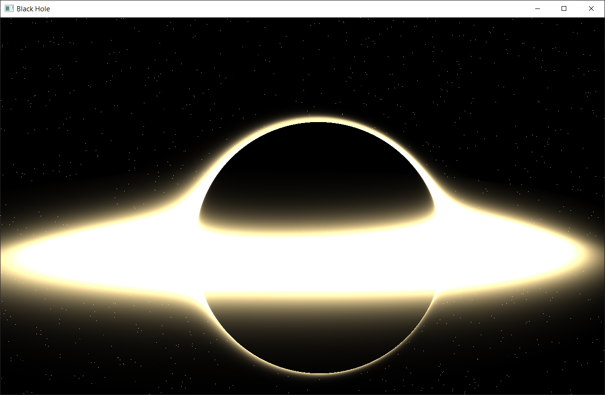
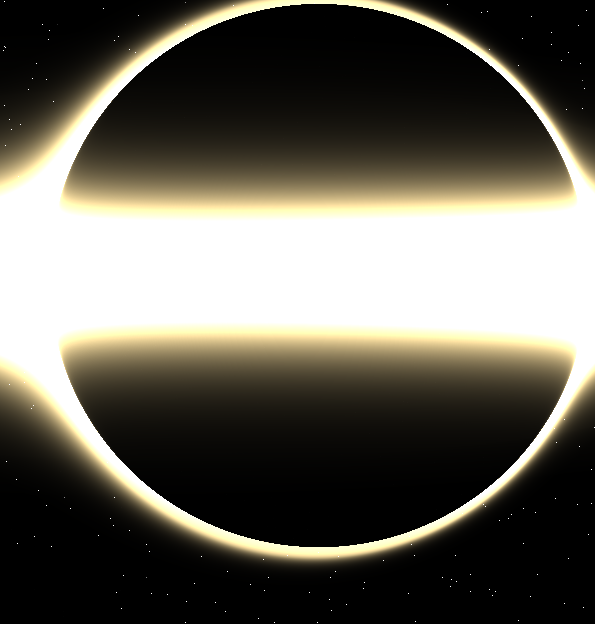
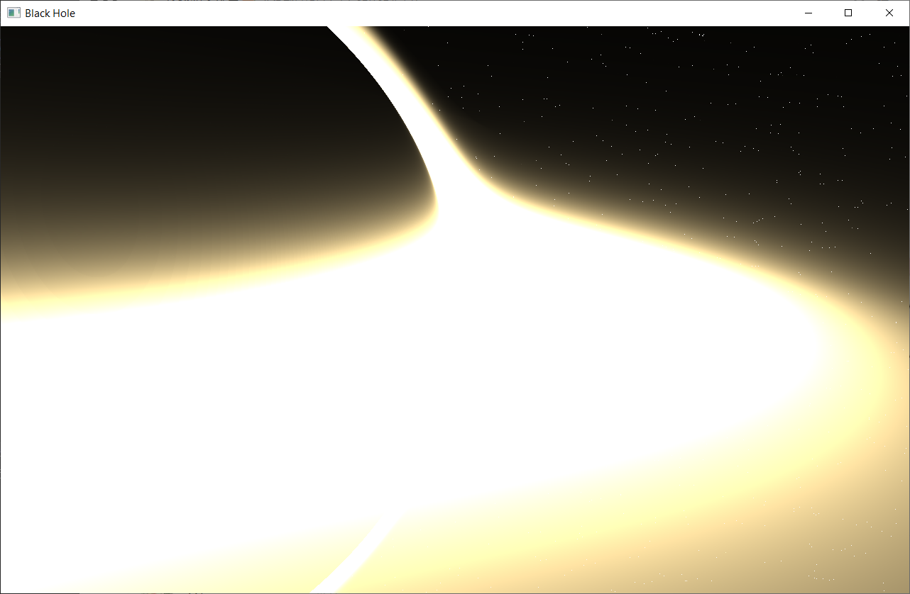

# 黑洞实时渲染与引力透镜模拟
## —— 基于 OpenGL 的 Kerr 黑洞可视化实现

## 1. 项目背景与研究意义

黑洞是广义相对论中最极端、最具代表性的物理对象之一。其强引力场会导致显著的**时空弯曲现象**，包括光线偏折（Gravitational Lensing）、爱因斯坦环（Einstein Ring）以及旋转黑洞中的帧拖拽（Frame Dragging）。

在电影《星际穿越》中，科学家 Kip Thorne 团队首次将广义相对论中的黑洞以高度真实的方式呈现出来，使黑洞的视觉表现不仅具有艺术价值，也具备了科学意义。

本作业以此为背景，尝试在**实时渲染**的约束下，对旋转黑洞（Kerr 黑洞）的主要视觉特征进行近似模拟和工程实现。

---

## 2. 作业目标

本作业的目标包括：

- 使用 OpenGL + GLSL 实现黑洞的实时渲染
- 通过 Ray Marching 方法模拟光线在强引力场中的传播
- 表现引力透镜、爱因斯坦环等关键现象
- 模拟 Kerr 黑洞的旋转效应（帧拖拽）
- 使用 HDR 星空贴图作为背景，增强真实感
- 支持相机自由移动，实现交互式观察

---

## 3. 系统架构与技术路线

### 3.1 整体架构

本项目采用 CPU 与 GPU 分工明确的实时渲染架构：

- **CPU（C++ / OpenGL）**
  - 窗口与上下文管理（GLFW）
  - 相机系统（WASD + 鼠标）
  - Uniform 参数传递
  - HDR 贴图加载（stb_image加载）

- **GPU（GLSL Fragment Shader）**
  - Ray Marching 光线步进
  - 引力透镜计算
  - Kerr 帧拖拽近似
  - 吸积盘体积积分
  - HDR 星空方向采样

渲染流程示意：

```
Camera → Ray → 时空弯曲 → 吸积盘 / 星空 → 像素颜色
```

---

### 3.2 渲染方式选择

本项目采用**全屏四边形 + Fragment Shader 光线步进（Ray Marching）**的方式进行渲染，而非传统的三维几何建模，原因包括：

- 黑洞本身不是可直接建模的实体物体
- 光线在时空中的传播行为比表面几何更重要
- Ray Marching 更适合表达连续的空间扭曲和引力透镜效应

---

## 4. 物理模型与近似方法

### 4.1 黑洞模型

采用归一化单位的 Schwarzschild 半径：

\[
R_s = 1.0
\]

并引入 Kerr 黑洞的自旋参数：

\[
a \in [0, 1)
\]

自旋通过对光线方向施加横向扰动的方式进行近似，用以表现帧拖拽效应。

---

### 4.2 引力透镜

光线在每一步中受到指向黑洞中心的偏折力：

\[
\vec{d}_{new} = \vec{d} + \frac{R_s}{r^2} \cdot \vec{n}
\]

在靠近事件视界时，对该偏折进行非线性增强，从而形成明显的爱因斯坦环结构。

---

### 4.3 事件视界的空间反转处理

与简单的“进入事件视界即变黑”的处理方式不同，本项目引入了：

- 扩展的事件视界过渡区域
- 光线方向逐渐翻转
- 亮度逐步衰减而非硬截断

从视觉上表现出空间被压缩、折叠并逐渐坠入黑洞的效果，这一做法更接近《星际穿越》中的呈现方式。

---

### 4.4 吸积盘模型

吸积盘采用体积密度模型：

- 吸积盘的直径保持不变
- 通过指数函数控制其厚度（宽度）
- 沿旋转方向引入弱多普勒效应

颜色整体采用偏暖黄的高亮色调，用以模拟高温等离子体的发光特性，而非明显的红蓝分离。

---

## 5. HDR 星空背景

为了获得真实的引力透镜效果，本项目使用 HDR 星空贴图作为背景环境：

- 根据光线最终方向进行采样
- 星空可被强烈弯折并形成爱因斯坦环
- 提供更真实的亮度动态范围


---

## 6. 交互方式与相机控制

- 鼠标：控制视角旋转
- W / A / S / D：相机前后左右移动
- 支持从不同距离、不同角度观察黑洞的透镜变化

---

## 7. 实验结果与效果展示

### 7.1 黑洞整体效果



可以观察到：

- 中心区域并非“死黑”，而是空间塌陷区
- 吸积盘被引力透镜翻转至黑洞上方
- 明显的爱因斯坦环结构

---

### 7.2 Kerr 旋转效应



由于帧拖拽效应，黑洞上下呈现非对称形态，吸积盘亮度分布也发生偏移。

---

### 7.3 吸积盘细节



吸积盘整体表现为：

- 宽度受控、结构紧凑
- 高亮、偏暖黄色调
- 与电影《星际穿越》中的视觉风格相近

---

## 8. 性能分析

- 分辨率：1280 × 800
- 最大 Ray Marching 步数：720
- 在普通桌面 GPU 上可达到实时帧率（约 30–60 FPS）

性能瓶颈主要来自 Fragment Shader 中的光线步进循环。

---

## 9. 局限性与改进方向

### 9.1 当前局限

- 未采用严格的 Kerr 测地线数值积分
- 多普勒与红移效应为视觉近似
- 未考虑真实的时间膨胀效应

### 9.2 改进方向

- 使用 Runge–Kutta 方法积分光线轨道
- 加入 Bloom / Glare 等后处理效果
- 提供 ImGui 实时参数调节
- 使用更高分辨率 HDR 星空贴图

---

## 10. 总结

本作业实现了一个可交互、实时的 Kerr 黑洞可视化系统，在工程复杂度、实时性能与视觉真实性之间取得了良好平衡。该系统展示了现代 GPU 在科学可视化与物理模拟中的应用潜力。


